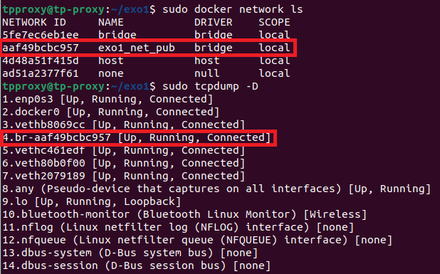
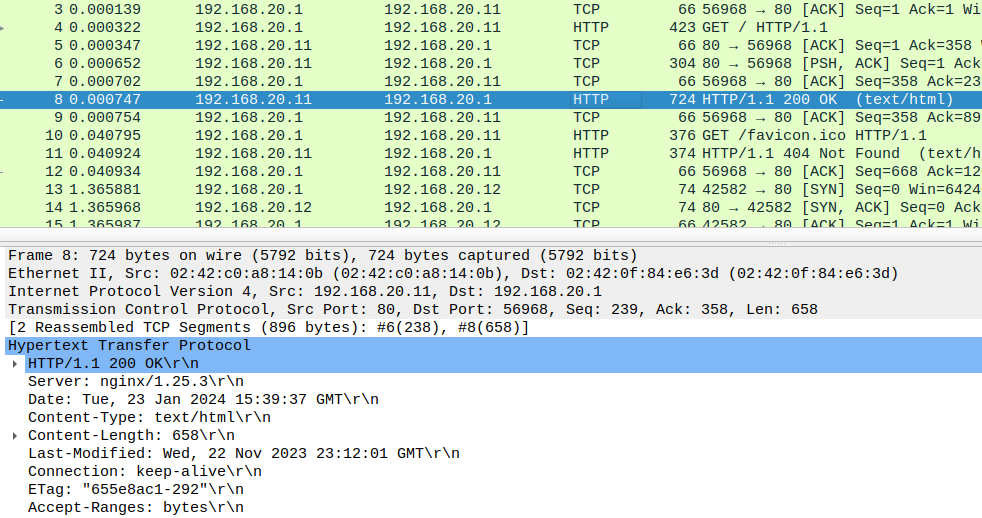
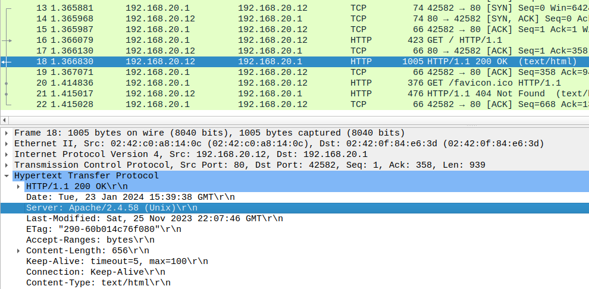
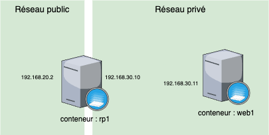
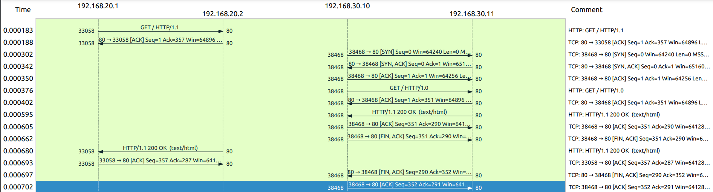
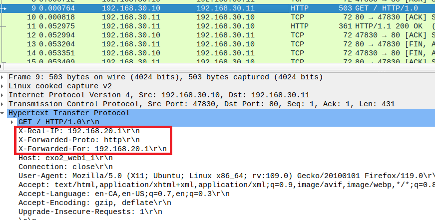

# Sécurité des réseaux avancés

Par [Mathis Boultoureau](https://github.com/mboultoureau/) et [Ronan Renoux](https://github.com/ronanren).

## Prise en main de l'environnement de tests

**Q1. Combien de réseaux sont actuellement créés ? Quels sont les différents types de réseaux listés par docker ?**

```bash
`sudo docker network ls
```

Il y a 4 réseaux listés :

| Nom du réseau | Type | Détail |
| --- | --- | --- |
| bridge | bridge | Réseau par défaut. Réseau isolé de l'hôte mais accessible depuis les conteneurs dans le même réseau. |
| exo1_net_pub | bridge | Réseau isolé de l'hôte mais accessible depuis les conteneurs dans le même réseau. |
| host | host | Même réseau que l'hôte sans aucune couche d'isolation |
| none | null | Réseau spécifique à chaque conteneur complétement isolé de l'hôte et des autres conteneurs |

**Q2. Quelle est l’adresse IP de la Busybox ?**

```bash
sudo docker inspect --type=network exo1_net_pub
```

L'adresse IP de la Busybox est 192.168.20.2/24.

Le réseau exo1_net_pub est sur l'adresse IP 192.168.20.0/24.

| Nom du conteneur | Adresses IP |
| --- | --- |
| exo1_web1_1 | 192.168.20.11/24 |
| exo1_web2_1 | 192.168.20.12/24 |
| exo1_busy1_1 | 192.168.20.2/24 |

```bash
sudo docker exec -it exo1_busy1_1 sh
ifconfig
```

Avec la commande *ifconfig*, nous avons bien l'ip du conteneur exo1_busy1_1 qui est 192.168.20.2.

**Q3. Que constatez-vous ? Quelle fonctionnalité est mise en avant en faisant ce test ?**

Toujours depuis la CLI du conteneur Busybox, nous lançons des pings vers les conteneurs *web1* et *web2* avec leurs IP et noms :

```bash
# Web1
ping web1
ping 192.168.20.11

# Web2
ping web2
ping 192.168.20.12
```

Nous constatons que le ping fonctionne que ça soit avec les adresses IP ou avec les noms. Docker propose un DNS qui par défaut lie les noms des conteneurs à leur IP (au sein du même réseau).

**Q4. A partir de l’inspection des streams TCP/HTTP, quelles sont les informations notables dans les entêtes HTTP échangées avec les deux serveurs web ? Est-ce qu’il y une différence entre les deux serveurs Web ? Quels sont les codes de retours HTTP et qu’indiquent-ils ? Quelle est la réponse bonus ?**

Nous regardons la liste des interfaces réseaux disponibles et la comparons avec la liste des réseaux Docker :

```bash
sudo docker network ls
sudo tcpdump -D
```



Nous pouvons lancer une capture réseau sur l'interface réseau qui correspond (en comparant les identifiants de réseau) et l'enregister dans le fichier `dump.pcap` (disponible dans `getting_started/files/dump.pcap`).

```bash
sudo tcpdump -w dump.pcap -i br-aaf49bcbc957
```

Nous analysons la capture d'écran avec Wireshark :

- Pour chaque site, le client envoie une requête avec la procotole et version (HTTP 1.1), la page demandé (/), la méthode (GET), l'user Agent, etc.
- Dans la réponse, le serveur renvoit la date, la date de modification, le code HTTP (ici 200), le protocole et version utilisé (HTTP 1.1), le type et la version du serveur, etc.

Le serveur *web1* est un serveur Nginx (1.25.3) tandis que le serveur *web2* est un serveur Apache (2.4.58).





Les codes de retours HTTP sont :
- 200 : la ressource est bien trouvé
- 404 : la ressource n'est pas trouvé (le navigateur par défaut demande `favicon.ico` qui n'est pas sur le serveur)

La réponse bonus est un kangouru (à la question `Who is Skippy?`).

## Mise en place d'un reverse proxy simple basé sur NGINX

**Q5. Décrivez sous la forme d’un schéma l’environnement de test instancié en distinguant les différents éléments et les différents réseaux/adresses IP impliqués.**

Il y a deux réseaux :

| Réseau | Subnet |
| --- | --- |
| net_pub | 192.168.20.0/24 |
| net_priv | 192.168.30.0/24 |

Il y a deux conteneurs :

| Conteneur | Description | Réseaux |
| --- | --- | --- |
| rp1 | Reverse proxy NGINX | net_pub (192.168.20.2), net_priv (192.168.30.10) | 
| web1 | Serveur HTTP Apache | net_priv (192.168.30.11) |

Si le client veut accèder au serveur web, il doit passer par le reverse proxy qui va intercepter la requête vers le serveur web et renvoyer la réponse au client. 



**Q6. Représentez sous la forme d’un graphe de flux le déroulement des échanges (aidezvous des fonctionnalités de Wireshark). Décrivez et expliquez les différents flux réseaux.**

```bash
sudo docker exec -it exi2_rp1_1 sh
tcpdump -i any -w dump.pcap -s0 port 80
sudo docker cp exo2_rp1_1:/dump.pcap .
```

Pour tcpdump, nous avons utilisé l'option `-i any` pour capturer tous les flux réseaux et filtrer sur le port 80 (HTTP), puis l'option `-s0` pour capturer le contenu des paquets.



Nous pouvons voir les étapes suivantes :
- Le client établit une connexion TCP avec le reverse proxy (sur le port 80). 
- Le client demande la page / avec une requête GET.
- Le reverse proxy renvoit un ACK pour signaler au client qu'il a bien reçu la requête et qu'il va la traiter.
- Le reverse proxy (sur son port 38468) établit une connexion avec le serveur web (sur son port 80).
- Le reverse proxy demande la page / avec une requête GET.
- Le serveur web renvoit la page au reverse proxy.
- Le reverse proxy confirme réception de la réponse.
- Le reverse proxy renvoit la page web au client.
- Le client confirme la bonne réception de la page.
- Le reverse proxy confirme la bonne réception de la page au serveur web.

**Q7. Quelles sont les principales différences entre les logs de rp1 et web1 ? Quels champs sont manquants pour la connexion via Telnet ? Quelles informations pertinentes pourraient être ajoutées côté web1 vis-à-vis du client ?**

```bash
telnet 192.168.20.2 80
GET /

sudo docker exec -it exo2_rp1_1 sh
more /var/log/nginx/rp1.access.log # Réponse : 192.168.20.1 "GET /" 200 45 "-" "-" "-"

sudo docker exec -it exo2_web1_1 sh
more /usr/local/apache2/logs/access_log # Réponse : 192.168.30.10 "GET / HTTP/1.0" 200 45 "-" "-"
```

Les différences entre les logs de rp1 et de web1 sont :
- l'IP source, le reverse proxy voit l'IP du client (192.168.20.1) tandis que le serveur web1 voit l'IP du reverse proxy (192.168.30.10).
- Le protocole et la version HTTP est ajouté dans les logs du serveur web1 car le reverse proxy l'ajoute si elle est manquante.

Les champs manquants pour la connexion via Telnet sont l'user agent et le protocole et la version utilisé (HTTP/1.0).

Les informations pertinentes qui pourraient être ajoutées côté web1 vis-à-vis du client sont :
- l'IP du client (via l'entête HTTP X-Forwarded-For)
- le protocole du client (via l'entête X-Forwarded-Proto)

**Q8. Comparez les entêtes HTTP côté client et côté serveur web1. Quels sont les avantages d’une telle configuration ?**

```bash
cat /home/tpproxy/exo2/rp1-custom.conf
cat /home/tpproxy/exo2/rp1-nginx.conf
```

Fichier `rp1-custom.conf` :

```conf
server {
    # Ecoute sur le port 80
    listen       80;
    listen  [::]:80;
    server_name  localhost;

    access_log  /var/log/nginx/rp1.access.log  main;

    # Reverse proxy du / vers le serveur web1
    location / {
        proxy_pass http://exo2_web1_1/;
    }

    #error_page  404              /404.html;

    # redirect server error pages to the static page /50x.html
    #

    # Pages d'erreurs contenu dans le dossier /usr/share/nginx/html
    error_page   500 502 503 504  /50x.html;
    location = /50x.html {
        root   /usr/share/nginx/html;
    }

}
```

Fichier `rp1-nginx.conf` :

```conf
user  nginx;
worker_processes  auto;

error_log  /var/log/nginx/error.log notice;
pid        /var/run/nginx.pid;


events {
    worker_connections  1024;
}


http {
    include       /etc/nginx/mime.types;
    default_type  application/octet-stream;

    # Format de log
    log_format  main  '$remote_addr - $remote_user [$time_local] "$request" '
                      '$status $body_bytes_sent "$http_referer" '
                      '"$http_user_agent" "$http_x_forwarded_for"';

    access_log  /var/log/nginx/access.log  main;

    sendfile        on;
    #tcp_nopush     on;

    keepalive_timeout  65;

    #gzip  on;

    # Inclusion des autres fichiers de configuration dont rp1-nginx.conf
    include /etc/nginx/conf.d/*.conf;
}
```

On a complété la configuration pour permettre l’ajout ou la modification d’entêtes HTTP X-Real-IP, X-Forwarder-For et X-Forwarded-Proto (dans le fichier `rp1-custom.conf`) :

```conf
server {
    # ...

    location / {
        proxy_set_header X-Real-IP $remote_addr;
        proxy_set_header X-Forwarded-Proto $scheme;
        proxy_set_header X-Forwarded-For $remote_addr;

        proxy_pass http://exo2_web1_1/;
    }

    # ...
}
```

Pour vérifier la modification, nous avons fait une capture réseau :

```bash
tcpdump -i any -w dump_forward.pcap -s0 port 80
sudo docker cp exo2_rp1_1:/dump_forward.pcap .
```



Nous remarquons bien que les 3 entêtes ont été ajoutés.

Les avantages d'une telle configuration sont :
- le serveur web1 peut savoir l'IP du client (via l'entête HTTP X-Forwarded-For et l'entête HTTP X-Real-IP et par exemple adapter la langue du site selon l'IP)
- le serveur web1 peut savoir le protocole du client (via l'entête X-Forwarded-Proto, http ou https)


**9. Quel est l’objectif de cette fonctionnalité ? Expliquez brièvement son fonctionnement**

NGINX propose de configurer des buffers. En activant les buffers on a les avantages suivants :
- Mise en cache de la réponse : si 2 clients demandent la même ressource (qui n'est pas différente entre les 2 clients comme des images), le reverse proxy peut la garder en cache pour répondre plus rapidement au client et ne pas soliciter le serveur web.
- Maintient de la session avec keep-alive : réutilise la même connexion TCP pour plusieurs requêtes HTTP en envoyant un "keep-alive" toutes les 5 minutes au client. Cela permet que le client a eu une réponse plus rapidement.
- Requête asynchrone : le reverse proxy stocke la réponse du serveur web jusqu'à ce qu'elle soit complète et la renvoie après au client. Lorsque le client n'a pas une bande passante élévé, le reverse proxy demande l'entiéreté de la réponse au serveur et stock la réponse pour la fournir petit à petit au client. Cela peut être un inconvénient pour les clients rapides si il souhaite avoir la réponse le plus vite possible.

## Réécriture d’URL avec un reverse proxy base sur NGINX

**Q10. En prenant en compte les éléments fournis, décrivez sous la forme d’un schéma l'environnement de test à instancier. Décrivez les réécritures à effectuer.**

